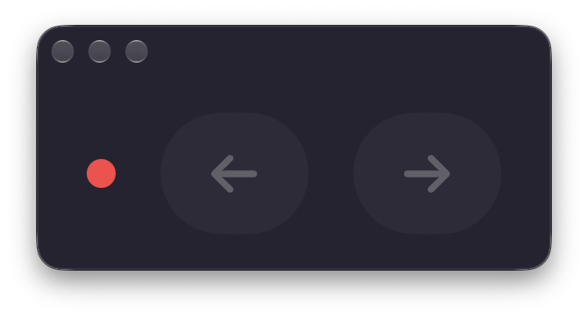

# Zwift Shifter

A small native SwiftUI macOS app that provides left/right virtual shifting buttons for a running Zwift session.

This is an experimental interoperability tool for the current Apple Silicon Zwift client. It was built and tested against a live Zwift session on 2026-08-27.



## Quick start

Requirements:

- Apple Silicon
- Xcode or Xcode command-line tools, including `xcrun lldb`
- Zwift running with a supported Click v2 controller selected as `ZP User Input`
- Zwift virtual shifting enabled by Zwift for the connected trainer

Build and launch:

```sh
cd /Users/dofa/ZwiftShifter
./build-app.sh
open build/ZwiftShifter.app
```

The app has two controls:

- `SHIFT LEFT` — one easier gear
- `SHIFT RIGHT` — one harder gear
- Left/right arrow shortcuts while the shifter window is focused

The source-level investigation journal, including the unsuccessful approaches and exact debugging trail, is in [`AGENTS.md`](AGENTS.md).

## What the app actually uses

The app does not press the physical Click buttons. It does not connect to Bluetooth, read a GATT characteristic, install a virtual HID driver, or send a keyboard shortcut to Zwift.

However, the current implementation is **not independent of all Click hardware**. Zwift gates its virtual-shifting feature on a supported controller being selected and connected as `ZP User Input`. The app reuses that existing Click v2 session identity and sends a synthetic controller notification through Zwift after the Bluetooth layer. If every Click is unplugged or unpaired, this build will report `Zwift Click session not found` or Zwift will not accept the event.

The live setup was detected as a Click v2/BC2 controller with firmware 1.1.0 and an `FC82` controller service. It was not the legacy Click v1 `0x37` path.

If “OG Click” means the original first-generation Click buttons, those buttons are not read or pressed by this app. If it means removing every physical Click device, that is not supported by this build.

## Why the first version lagged

The first working implementation launched LLDB on every button press:

1. Start `xcrun lldb -p <Zwift PID>`.
2. Attach to the entire Zwift process.
3. Set a breakpoint in the live BLE bridge.
4. Wait for a BLE event so the bridge receiver was available.
5. Evaluate an Objective-C expression that injected a press and release.
6. Detach.

Attaching a debugger stops the target process while LLDB is negotiating the attach and evaluating the expression. That produced the visible approximately one-second freeze on every click.

The current implementation attaches LLDB only once per Zwift process to load `ZwiftShiftBridge.dylib`. After that, buttons use a local Unix-domain socket. Normal button presses do not start LLDB and do not pause Zwift.

The bridge deliberately waits 80 ms between the press and release frames and another 80 ms afterward. The measured socket command round trip is approximately 160–170 ms, and this spacing prevents one direct call from being interpreted as multiple repeated gears.

## End-to-end behavior

```text
SwiftUI button or arrow shortcut
        |
        v
ZwiftShifter actor
        |
        |  /tmp/zwift-shifter-<uid>.sock
        v
ZwiftShiftBridge.dylib inside Zwift
        |
        |  Zwift BridgeInterface method
        v
Zwift ZP User Input parser
        |
        v
Zwift virtual-shifting state and trainer resistance
        |
        v
Gear number in the Zwift HUD
```

On the first connection for a Zwift PID, the app:

1. Finds `ZwiftAppSilicon` using `pgrep`.
2. Reads the most recent Click connection UUID from `~/Documents/Zwift/Logs/Log.txt`.
3. Runs LLDB once and calls `dlopen()` on the bundled bridge library.
4. Waits for the library to capture Zwift's bridge receiver.
5. Enables the buttons when the bridge reports ready.

For later commands, the app sends one of these local messages:

```text
S
D|<CLICK_PERIPHERAL_UUID>
U|<CLICK_PERIPHERAL_UUID>
```

`S` asks for bridge status. `D` is the easier direction and `U` is the harder direction. The bridge replies with:

- `R` — receiver captured and ready
- `W` — library loaded but still waiting for an event receiver
- `E` — hook installation failed

The Unix socket is created with mode `0600` and is local to the current user.

## Verified controller frames

These are the exact bytes that were observed to work with the live Click v2/BC2 path:

| Meaning | Bytes | Explanation |
| --- | --- | --- |
| Easier | `23 08 ff fb ff ff 0f` | `0x23` controller notification; field 1 is `0xfffffdff`, clearing bit `0x0200` |
| Harder | `23 08 ff df ff ff 0f` | `0x23` controller notification; field 1 is `0xffffefff`, clearing bit `0x1000` |
| Release | `23 08 ff ff ff ff 0f` | `0x23` controller notification; field 1 is `0xffffffff` |

The packet is a protobuf-like `RideKeyPadStatus` message:

- `0x23` is the controller notification opcode.
- `0x08` is protobuf field 1, `ButtonMap`, encoded as a varint.
- A cleared bit represents a pressed button in this message format.
- The all-released `0xffffffff` value encodes as `ff ff ff ff 0f`.

The published Ride mask names differ between older protocol definitions and the current open-source implementation. The bytes above are documented by their observed behavior, not by trusting an outdated enum name. On this live session, `0x0200` produced the easier/downshift action and `0x1000` produced the harder/upshift action.

The bridge invokes Zwift's own method with these arguments:

```text
receiver: the live BridgeInterface object
serviceId: FC82
characteristicId: 00000002-19CA-4651-86E5-FA29DCDD09D1
characteristicFlags: 0x10
value: NSData containing one frame above
length: frame length
```

The actual per-device UUID is intentionally not stored in source or documentation. The app discovers it from Zwift's current log.

## Clean lifecycle behavior

Quitting and reopening the shifter app while Zwift stays open works:

- The injected bridge remains in the Zwift process.
- The Unix socket remains available.
- A newly opened shifter app finds the existing socket and reconnects.
- The new app instance does not need to attach LLDB again.

If Zwift itself is restarted, its process ID changes and the old injected library disappears with the old process. The next shifter app status check finds the new PID and performs the one-time load again.

The shifter app does not persist gear state. Zwift remains the source of truth for the displayed gear.

## Building and testing

```sh
cd /Users/dofa/ZwiftShifter
swift test
./build-app.sh
codesign --verify --deep --strict build/ZwiftShifter.app
```

The test suite covers the three protocol frame encodings. The build script:

1. Builds the Swift executable in release mode.
2. Compiles the Objective-C bridge as an arm64 dynamic library.
3. Places the executable, bridge, and `Info.plist` in an app bundle.
4. Applies an ad-hoc signature.

Derived `.build` and `build` directories are ignored by Git. The repository contains the source and build script, not a machine-specific compiled app.

## Source layout

- `Sources/ZwiftShifter/ZwiftBridge.swift` — Zwift PID discovery, Click UUID discovery, one-time LLDB load, Unix-socket client, and command lifecycle
- `Sources/ZwiftShifter/AppModel.swift` — observable UI state and command handling
- `Sources/ZwiftShifter/ContentView.swift` — minimal SwiftUI UI, buttons, status, and shortcuts
- `Sources/ZwiftShifter/ZwiftShifterApp.swift` — app entry point
- `Sources/ZwiftShifterCore/ShiftDirection.swift` — verified frame constants
- `Sources/ZwiftShifterBridge/ZwiftShiftBridge.m` — injected Objective-C bridge, capture-and-restore hook, socket server, and frame sender
- `Tests/ZwiftShifterTests/ShiftDirectionTests.swift` — protocol frame regression tests
- `Resources/Info.plist` — app bundle metadata
- `build-app.sh` — release build and ad-hoc bundle script
- `AGENTS.md` — complete reverse-engineering and implementation journal

## Limitations and compatibility

This is not an official Zwift API and is not guaranteed to survive a Zwift update. It relies on the current Objective-C class and selector remaining available:

```text
BridgeInterface
addCharacteristicNotificationEvent:serviceId:characteristicId:characteristicFlags:value:length:
```

It currently targets:

- `ZwiftAppSilicon` on Apple Silicon
- the current `FC82` Click v2 controller path
- a Zwift session in a mode where Zwift permits virtual shifting
- a trainer for which Zwift has enabled virtual shifting

Zwift can reject shifts in ERG workout blocks or when the selected virtual-shifting controller/trainer configuration is not ready.

The app is ad-hoc signed and not notarized. LLDB must be available and macOS must allow the signed-in user to debug their own process.

## Privacy and safety notes

The code does not contain account credentials, access tokens, refresh tokens, private keys, Bluetooth MAC addresses, or the live device UUID. It reads only the local Zwift process ID and the selected Click UUID from a local log. The bridge communicates over a mode-0600 Unix socket and does not open a listening network port.

The full investigation notes intentionally use placeholders for session-specific identifiers and transient ASLR addresses. See [`AGENTS.md`](AGENTS.md) for the complete technical trail.
